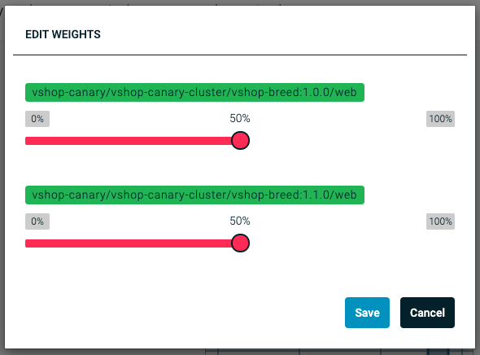

# Demo: Canary

This will demonstrate the possibility of canary releases using workflows.

## Setup

We deploy the initial state of the demo using the `demo.sh` shell script and specify the environment name.

```sh
./demo.sh deploy -d=01-canary
./demo.sh run -d=01-canary
```

It take some time until the application is deployed. Verify if the application is running at `http://vshop-canary.{name}.demo-ee.vamp.cloud`

### Apache Bench

During the demo there is a need to put load on the application. An easy way to do this is to make use of Apache Bench. It is possible to install Apache Bench using the Google Cloud Shell.

```sh
sudo apt-get update && sudo apt-get -y install apache2-utils
```

## Demonstration

### Application

The vshop application demonstrates a typical web application which is able to run as two different version. Each version has a different color for the user interface.


### Changing weights

Show the `vshop-canary` gateway and change the weights using the UI. This will route the incoming requests to the two different versions using the weight values. 50% means that half of the requests will be served by version 1.0.0 and the other other half by version 1.1.0.



### Successful canary release

Start the `canary` workflow. This will begin the process of canary releasing the application with increments of 5%. The Vamp Gateway User Interface will visualize the process.


During the process you can see the Vamp Gateway changing the traffic weight automatically. The application should reflect those changes by alternating between the blue and the red version of the vshop.

### Failing canary release

Change the weights of the v1 route back to 100%. Now we will start a canary release and generate traffic. The application has a build-in feature to simulate problems. Vamp will be able to act on those problems to abort the release and change the route back to 1.0.0.


During the release you should put traffic on the gateway by using Apache Bench using the following command;

```sh
ab -n 15000 -c 10 http://vshop-canary.{name}.demo-ee.vamp.cloud/
```

## Details

### Canary release workflow

Show the canary release script defined as Vamp breed [canary-breed.yaml](canary-breed.yaml).

**Pointer**

- You can create similar scripts and execute them with Vamp.
- Scripts are written in Java Script and doesn't require any additional knowledge.

### Vamp Deployment

Show the [Vamp Deployment](vshop-deployment.yaml) and explain how Vamp interacts with Kubernetes and HA-Proxy using gateways.

**Pointer**

- Vamp supports deployments for both Kubernetes and DC/OS (Marathon)
- Deployments can be templated using blueprints
- Deployments can be put under version control
- Vamp provides an API, UI and CLI to create deployments

## Reset

To reset the demo in it's original state you can un-deploy the demo;

```sh
./demo.sh undeploy -d=01-canary
```

And deploy it again.

```sh
./demo.sh deploy -d=01-canary
```
