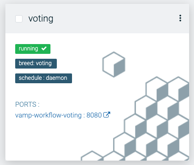
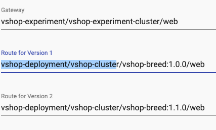
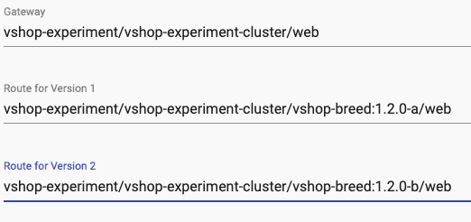
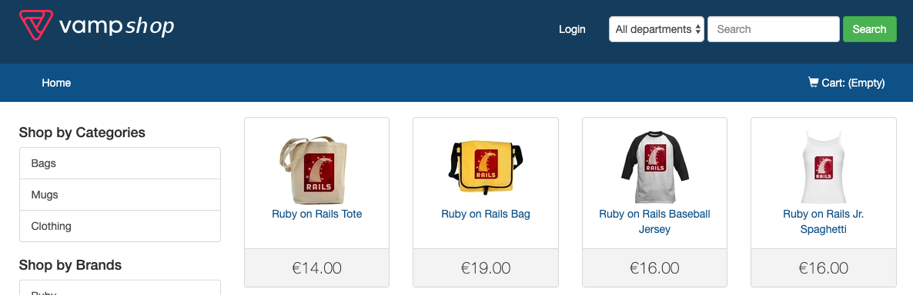
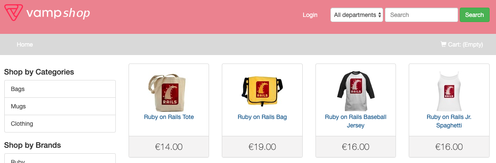
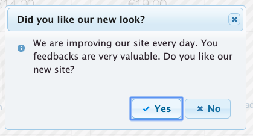
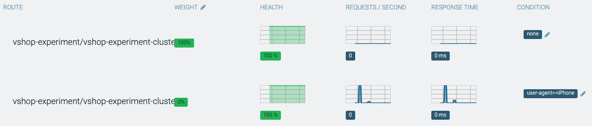
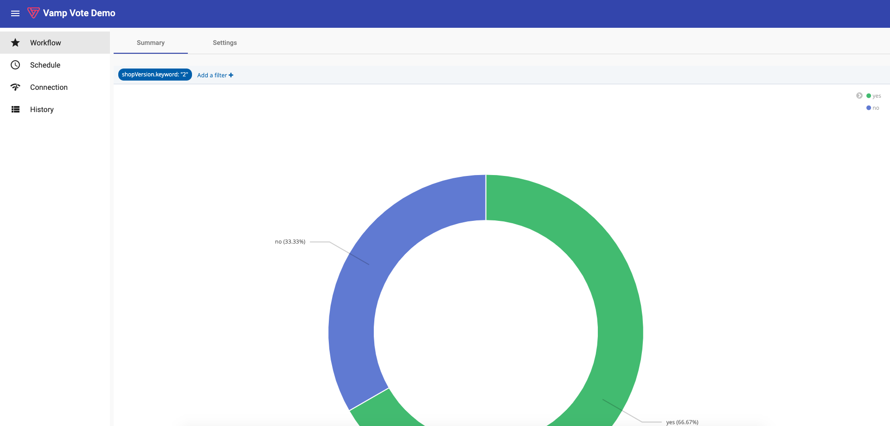
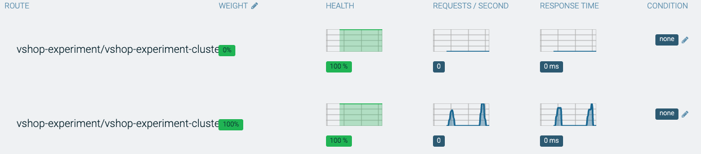

# Demo: A/B Experiment

This will demonstrate the possibility of canary releases with A/B Experimentation using workflows.

## Setup

We deploy the initial state of the demo using the `demo.sh` shell script and specify the environment name.

```sh
./demo.sh deploy -d=02-experiment
./demo.sh run -d=02-experiment
```

It take some time until the application is deployed. Verify if the application is running at `http://vshop-experiment.{name}.demo-ee.vamp.cloud`

### Simulate iPhone

When you are using Google Chrome it is easy to simulate the browser as iPhone by changing the user agent. Follow this guide on how to do this. [Change User Agent in Chrome](https://winaero.com/blog/change-user-agent-chrome/)

### Voting Workflow

Currently there is a bug in the voting workflow which requires to change the settings. Within Vamp go to the Voting workflow, go to settings and change the route 1 and route 2 setting.

- Route for Version 1: `vshop-experiment/vshop-experiment-cluster/vshop-breed:1.2.0-a/web`
- Route for Version 2: `vshop-experiment/vshop-experiment-cluster/vshop-breed:1.2.0-b/web`





## Demonstration

### Application

The vshop application demonstrates a typical web application which is able to run as two different version. Each version has a different color for the user interface. The A/B Test is targeted to iPhone users only. This means that only iPhones will see the new red interface. When the red version of the application is showing to the user it will ask if it likes the new color. The answer to this question will be the input to the decision which user interface "performs" better.





### Segmentation

First show the `vshop-experiment` gateway and how it is possible to segment een route by changing its conditions.



Open the web browser and simulate an iPHone or open the url on a iPhone and demonstrate that it will show the red version of the application with the question if they like this version better.

### Voting Result

The vote of the user will be registered in Elasticsearch. With a tool like Kibana it is easy to visualize the results.

Open the Voting workflow and show the graph displaying the voting results.




### A/B Test result

When the application get 5 or more results it will release the version of the application with the most votes.



## Details

### Voting workflow

Show the canary release script defined as Vamp breed [voting-breed.yaml](voting-breed.yaml).

**Pointer**

- You can create similar workflows and execute them with Vamp.
- You can expose the UI of the workflow by assigning a `web port`.
- Vamp allows you to define custom metrics and use then within your workflows.

### Vamp Deployment

Show the [Vamp Deployment](vshop-deployment.yaml) and explain how Vamp interacts with Kubernetes and HA-Proxy using gateways.

**Pointer**

- Vamp supports deployments for both Kubernetes and DC/OS (Marathon)
- Deployments can be templated using blueprints
- Deployments can be put under version control
- Vamp provides an API, UI and CLI to create deployments

## Reset

To reset the demo in it's original state you can un-deploy the demo;

```sh
./demo.sh undeploy -d=02-experiment
```

And deploy it again.

```sh
./demo.sh deploy -d=02-experiment
```
