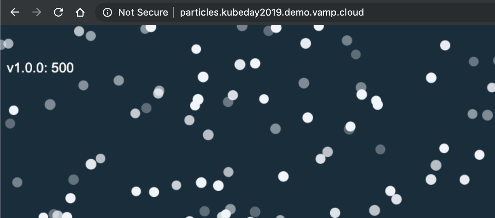
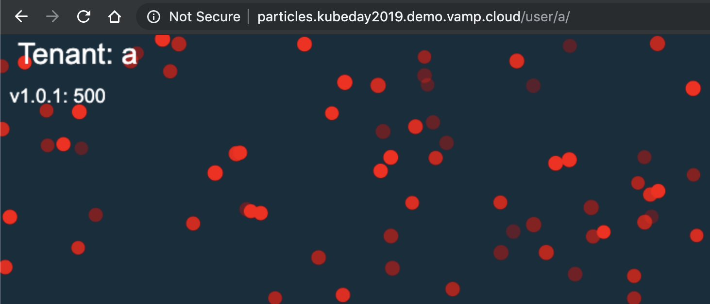
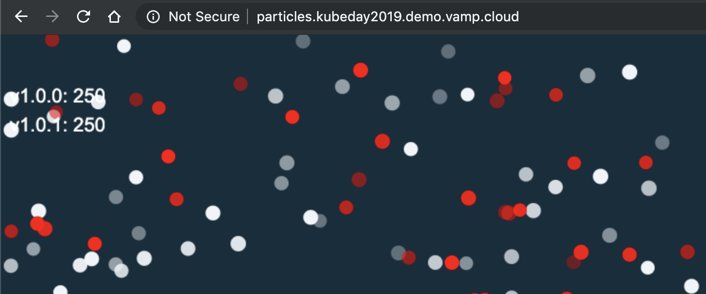
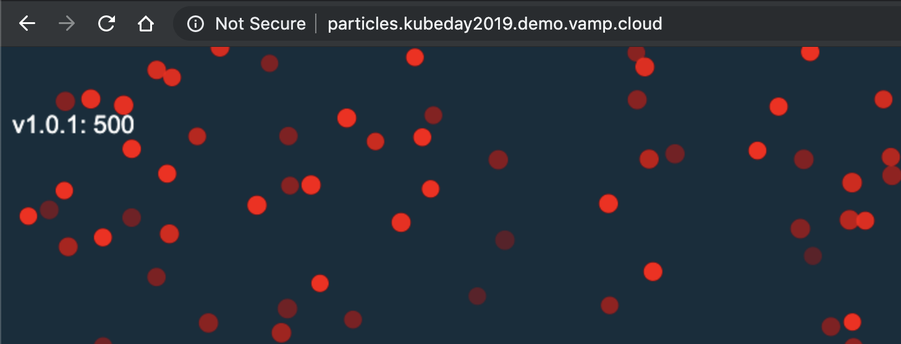
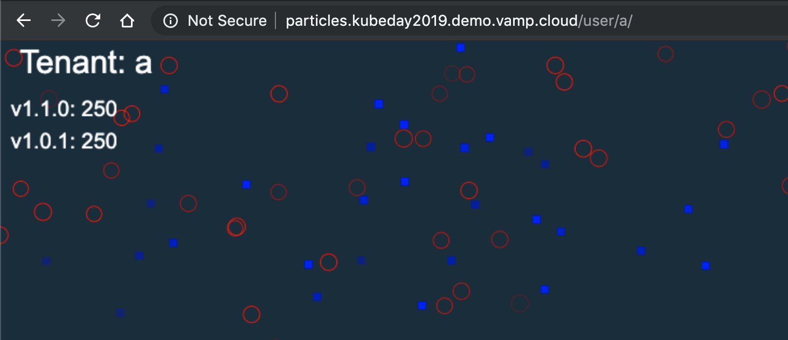
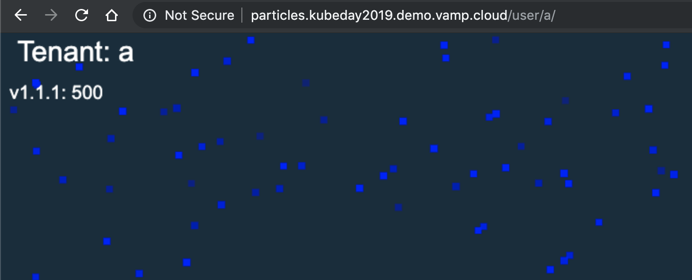
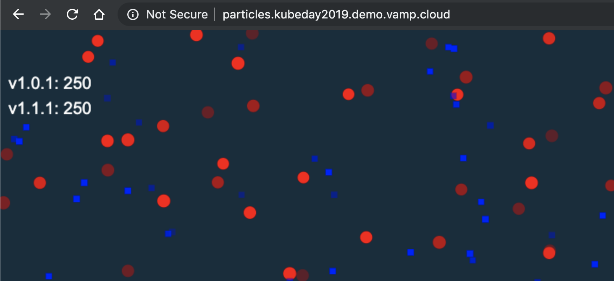
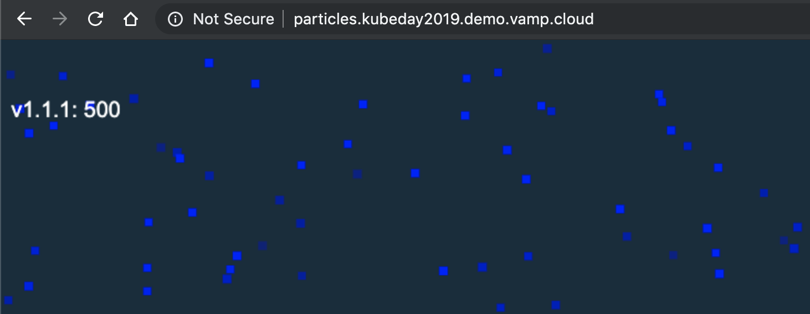

# Demo: Particles

This will demonstrate the possibility to release services into production using release policies.

## Setup

For this demo it's required to have the Vamp Release Agent running as workflow. The release agent should contain a valid policy which will be used to release the service.

We deploy the initial state of the demo using the `demo.sh` shell script and specify the environment name.

```sh
./demo.sh deploy -d=04-particles
```

Verify if the application is running at `http://particles.{name}.demo.vamp.cloud`.

## Demonstration

### Application

The particles application demonstrates the user experience during a release. The application renders a cluster of particles and communicates towards a backend to get the properties of the particles.

- Particles closed means that there is a successful connection for those particles to the backend.
- Particles open means that the connection to the backend has failed.

We are setting different colors and shapes for each version. This way we can demonstrate the behavior of the network calls during a release.

- [Deployment v1.0.0](particles-v1.0.0.yaml)
- [Vamp Gateway](particles-gateway.yaml)



### Release Policy

For the release of this application we have defined the following release policy.

- All the traffic is on the current version and non of the traffic on the new version for 30 seconds.
- Only traffic for `user a` goes the new version, but all other traffic remains on the current version for 1 minute.
- Only traffic for `user a` and 50% of all the other traffic goes the new version of 1 minute.
- All traffic will go to the new version.

Show the [Release Policy](policy-patch.json) and explain the policy.

### Patch release

First we release a new patch version of the application. This patch version will change the color of the particles to red.

Deploy the `1.0.1` version of the application using the Kubernetes CLI.

```sh
kubectl apply -f ./demos/04-particles/particles-v1.0.1.yaml
```

During the release you can show two urls `http://particles.{name}.demo.vamp.cloud` and `http://particles.{name}.demo.vamp.cloud/user/a`. The last URL demonstrated the ability to segment users/tenants and release new version to a small subset of users.





## Minor release

Now we will release a new version of the application which has a different shape and color for the particles.

Deploy the `1.1.0` version of the application using the Kubernetes CLI.

```sh
kubectl apply -f ./demos/04-particles/particles-v1.1.0.yaml
```

This deployment as configured an error rate which simulates that 50% of the calls towards the backend are failing. During the release this should result in the behavior that the release is being rolled back as soon as the application reports itself unhealthy.




## Minor patch release

The last step is the fix the problem by removing the error rate from the deployment.

```sh
kubectl apply -f ./demos/04-particles/particles-v1.1.1.yaml
```





### Release Policy

For the release of this application we have defined the following release policy.

- All the traffic is on the current version and non of the traffic on the new version for 30 seconds.
- Only traffic for `user a` goes the new version, but all other traffic remains on the current version for 1 minute.
- Only traffic for `user a` and 50% of all the other traffic goes the new version of 1 minute.
- All traffic will go to the new version.

Show the policy file [policy-patch.json](policy-patch.json) and it's structure.

**Pointer**

- You can define your own steps.
- Each step has a weight for the source version and target version.
- You can define the metrics and baselines for a release and use that as condition to check before advancing to the next step.
- Once a service has successfully release, there is the possibility to add a command to call a REST API to notify.

### Vamp Gateway configuration

Show the [Vamp Gateway](particles-gateway.yaml) and explain how Vamp triggers the release.

**Pointer**

- All things happing within Vamp and the cluster are raised as events
- The Vamp Release Agent listens to those events and reacts.
- When a route has been added to a gateway the release agent will look at the `release.vamp.io/policy` metadata to see if is should trigger a release with that policy.
- The release agent looks a `release.vamp.io/current` metadata to determine what its current release is.
- If no release is found it tags the route with 100% of weight as current release.
- The release agent starts releasing the service according to it's policy.

### Releasing a service

With Vamp we demonstrate the difference between deploying a service and releasing a service. We are using the Kubernetes CLI to deploy the service in Kubernetes.

**Pointer**

- Deploying is the event which will make sure the container is available and health inside the cluster
- Releasing is the event which results in the availability of the functionality to the end user.
- Vamp detects Kubernetes deployments and add routes to the gateway according to the label selector
- When a route has been added to the gateway a `route:added` event is raised which results in the releasing of the container according to the configured policy.

## Reset

To reset the demo in it's original state you can un-deploy the demo;

```sh
./demo.sh undeploy -d=04-particles
```

And deploy it again.

```sh
./demo.sh deploy -d=04-particles
```

If for some reason the CLI isn't an option you delete all Kubernetes deployments except v1.0.0.

```sh
kubectl delete -f ./demos/04-particles/particles-v1.0.1.yaml --namespace vampio-organization-environment
kubectl delete -f ./demos/04-particles/particles-v1.1.0.yaml --namespace vampio-organization-environment
kubectl delete -f ./demos/04-particles/particles-v1.1.1.yaml --namespace vampio-organization-environment
```

Next you should in Vamp set the `particles` gateway `release.vamp.io/current` back to `(1.0.0)` and the weight of route `(1.0.0)` to 100%.
